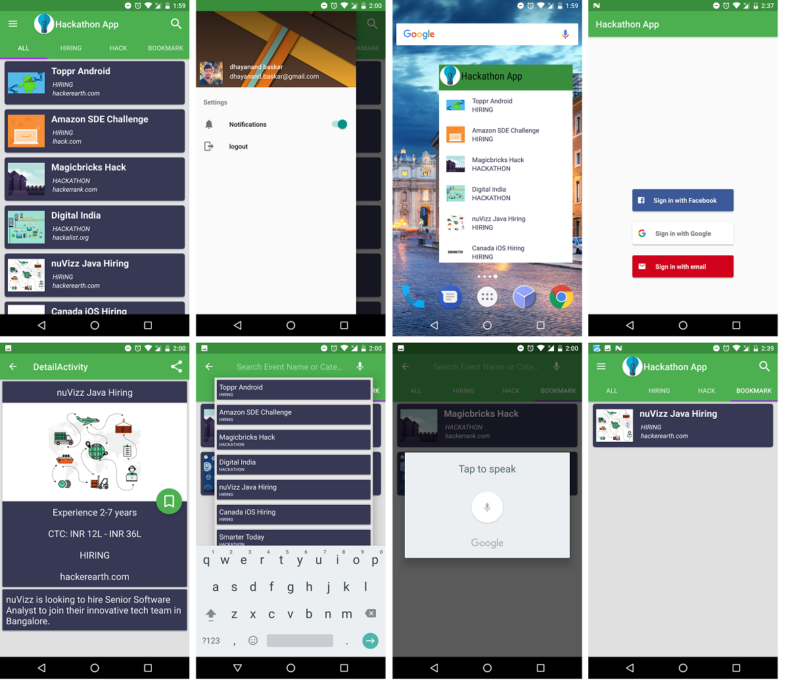
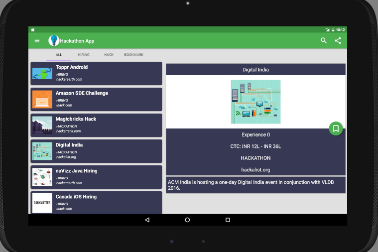

# HackathonApp #
The Hackathon App is a one stop shop for all the upcoming hackathons that are about to take
place. Its helps search for hackathons, have a detail view about it and also lets you bookmark
them. You can share the upcoming hackathon event to your friends. You can have a widget for
all the upcoming events.

## Integrated Android Components: ##
    *Firebase
    *Content provider
    *Loaders
    *Sync Adapter
    *Widget
    *Navigation View
    *View Holder
    *View pager
    *Item choice Manager
    *Custom Suggestion (Search view)
    *Voice Search.

## Features ##
    *Sort event into tabs based on category and bookmark
    *Bookmark events
    *Detail Widget for the home screen
    *Custom search suggestions
    *User Login
    *Share events with friends
    *Works offline even in places where the user can't access internet

